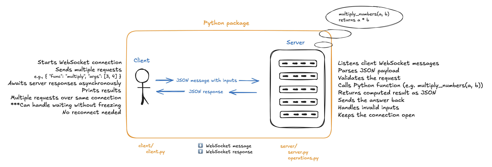

# 📦 WebSocket Client–Server Package  
*A minimal async compute service demonstrating structured WebSocket communication - similar in pattern to an AI Control Layer.*

## 📘 Overview

This project implements a small Python package consisting of a **WebSocket Server** and **WebSocket Client**.

The client sends JSON-structured compute requests such as:

```json
{ "func": "multiply", "args": [3, 4] }
```

The server validates the request, calls a Python function, and returns:

```json
{ "result": 12 }
```

This mirrors how an AI control layer receives structured requests, validates them, executes tools/functions, and sends structured responses.

## 🏛 Architecture



The system is divided into two modules:

### **Client**

- Opens WebSocket connection  
- Sends JSON compute requests  
- Awaits server responses asynchronously  
- Prints results  
- Handles multiple calls cleanly  

### **Server**

- Listens for WebSocket messages  
- Parses JSON payload  
- Validates the request  
- Routes to Python functions (`operations.py`)  
- Sends structured JSON results  
- Handles invalid inputs  
- Keeps the connection open  

## 🗂 Project Structure

```
snps_WebSocket/
│
├── client/
│   ├── __init__.py
│   └── client.py
│
├── server/
│   ├── __init__.py
│   ├── server.py
│   └── operations.py
│
├── tests/
│   ├── test_e2e.py
│   └── test_operations.py
│
├── assets/
│   └── architecture_overview.png
│
├── requirements.txt
└── README.md
```

## ⚙️ Setup & Installation

### 1. Create & activate virtual environment

```bash
cd snps_WebSocket
python3 -m venv venv
source venv/bin/activate
```

### 2. Install dependencies

```bash
pip install -r requirements.txt
```

## 🚀 Running the Server

⚠ **macOS Note:**  
`uvicorn --reload` can silently kill the WebSocket worker.  
Run the server *without* reload:

```bash
uvicorn server.server:app --host 127.0.0.1 --port 8000
```

Expected output:

```bash
Uvicorn running on http://127.0.0.1:8000
Application startup complete.
```

## 🧪 Running the Client

With the server running, open a second terminal:

In Terminal 2 (click + for new tab):

```bash
cd snps_WebSocket
source venv/bin/activate
lsof -i :8000
```

Expected output: 

```bash
python3.x PID saifar ... TCP 127.0.0.1:8000 (LISTEN)
```

This means the WebSocket server is alive and ready.
Test raw WebSocket connection Still in Terminal 2: 

```bash
python - << 'EOF'
from websocket import create_connection
ws = create_connection("ws://127.0.0.1:8000/ws")
print("CONNECTED OK!")
ws.close()
EOF
```

Expected:

```bash
CONNECTED OK!
```

**Run the client:**

```bash
python client/client.py
```

Expected:

```bash
Connected to server. Sending requests...
3 * 4 = 12.0
10 * 8 = 80.0
-5 * 3 = -15.0
```

### 🔧 Server Logic

The server exposes a Python function located in server/operations.py:

```bash
def multiply_numbers(a: float, b: float) -> float:
    return a * b
```

This function is executed when the client requests "func": "multiply".

## 📡 Message Protocol

### Client → Server request:

```bash
{
  "func": "multiply",
  "args": [3, 4]
}
```

### Server → Client response (success):

```bash
{
  "result": 12
}
```

### Server → Client error example:

```bash
{
  "error": "Unknown function 'divide'"
}
```

## 🧩 Tests

Run all tests:

```bash
pytest -q
```

Included tests:

- Unit test: multiply_numbers()
- End-to-end WebSocket request/response

## 🌟 Design Notes

This project models how an AI Control Layer works:

- persistent WebSocket communication
- structured messages
- validation + routing
- async execution
- predictable JSON responses

## 🛠 Possible Extensions (Developer Pitch)

- Add additional functions (add, divide, pow, etc.)
- Add message IDs for concurrent calls
- Maintain a persistent WebSocket connection for batching
- Add authentication (API keys or JWT)
- Add streaming responses (server push)

## ✔ Completed Requirements (This Sprint)

- Python package
- WebSocket server
- WebSocket client
- sync function
- Multiple call demonstration
- README with setup & example output
- Error handling
- Type hints + docstrings
- Optional tests

## 🎉 Done